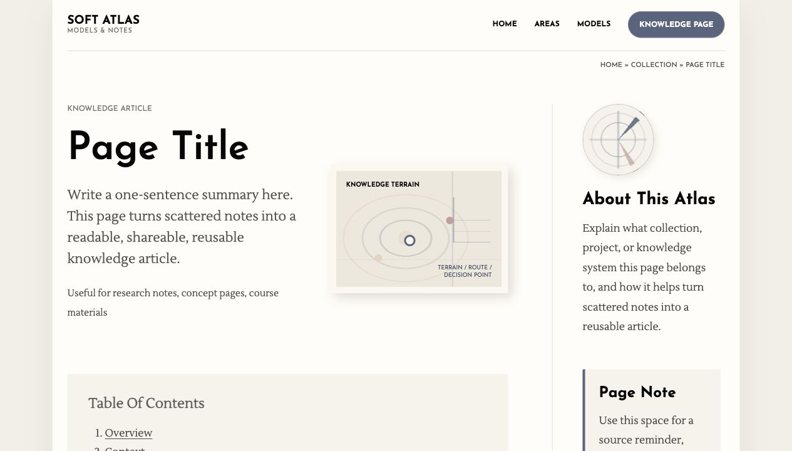

# Soft Atlas for Obsidian

**Soft Atlas** is a calm editorial layout pack for Obsidian knowledge pages.



It is designed to help people turn scattered notes into readable, shareable, reusable outputs: knowledge articles, course pages, prompts, checklists, workshop material, and research summaries.

**Feature:** this layout is made for output, not storage. It gives each page a clear reading path so messy notes can become a polished knowledge article that other people can read, use, and share.

Use it for model notes, psychology concepts, research summaries, course cards, coaching tools, and any long-form note that should feel more like a thoughtful knowledge page than a raw Markdown file.

The visual language is quiet and low-saturation: large geometric headings, warm paper panels, grey serif body text, muted blue labels, knowledge-terrain graphics, constellation/pathway cards, and a right-hand compass mark.

## What It Includes

```text
soft-atlas-obsidian-layout/
  README.md
  snippets/
    soft-atlas-knowledge-page.css
  templates/
    Soft Atlas Model Page.md
  examples/
    Blank Knowledge Page Template.md
  assets/
    sample-screenshot.png
    sample-screenshot.svg
  sample-preview.html
```

## Best For

- Psychology and wellbeing models
- Research notes and theory pages
- Coaching or reflection tool libraries
- Course knowledge cards
- Personal knowledge base essays
- Obsidian notes meant to be read in Reading view

## Example Note

The example note is intentionally content-light, but it is still a complete blank template. People can open `examples/Blank Knowledge Page Template.md` to inspect the layout, copy the structure, and replace the placeholders with their own content.

## Install

1. Copy the CSS snippet into your Obsidian vault:

```text
YourVault/.obsidian/snippets/soft-atlas-knowledge-page.css
```

2. In Obsidian, open:

```text
Settings -> Appearance -> CSS snippets
```

3. Refresh the snippet list and enable `soft-atlas-knowledge-page`.

4. Copy `templates/Soft Atlas Model Page.md` into your template folder.

## Use

Add this to a note's frontmatter:

```yaml
---
cssclasses:
  - soft-atlas-page
---
```

Then write inside the template structure:

- Top brand bar
- Breadcrumb
- Page Header with title, summary, use cases, and a quiet visual card
- Table of contents
- Article sections for moving from rough notes to synthesis
- Right-hand brand/note column
- Knowledge Links for sources, companion ideas, and reusable outputs

The default page flow is:

```text
Page Header
Table of Contents

Overview
Context
Key Ideas
Working Notes
Synthesis
How to Use This
Summary

Knowledge Links
  Source Notes
  Companion Ideas
  Reusable Outputs

Sidebar
  About This Atlas
  Page Note
```

## Reading View Note

Soft Atlas uses HTML containers for layout. It looks best in Obsidian **Reading view**.

In Live Preview, clicking inside the note may reveal the underlying Markdown or HTML. That is normal Obsidian behavior. Use `Cmd + E` on macOS, or the Reading/Edit toggle, when you want the designed page view.

## Design Notes

- Headings use `Josefin Sans`.
- Body text uses `Lustria`.
- Main colors are ink black, soft grey, warm off-white, muted blue, dusty rose, and pale sand.
- Main diagram cards use knowledge-terrain graphics: contour-like lines, route marks, and decision points.
- Knowledge Links use three smaller cards: source notes, companion ideas, and reusable outputs.
- The sidebar brand mark uses an abstract compass to suggest orientation rather than decoration.
- The templates avoid fake form fields or empty controls. Sidebar cards should contain real notes, source reminders, or editorial context.
- The layout keeps a narrow article column with a supporting right sidebar.

## Suggested Image Style

Use these prompts or keywords for matching model graphics:

```text
muted colors, editorial knowledge terrain, contour lines,
soft compass mark, constellation notes, branching pathway,
warm off-white background, low saturation, research notebook style
```

## Compatibility

The snippet supports both:

```yaml
cssclasses:
  - soft-atlas-page
```

and the older trial class:

```yaml
cssclasses:
  - pathfinder-page
```

This makes it safe to update older test notes without breaking the layout.

## Suggested Repository Name

```text
soft-atlas-obsidian-layout
```
